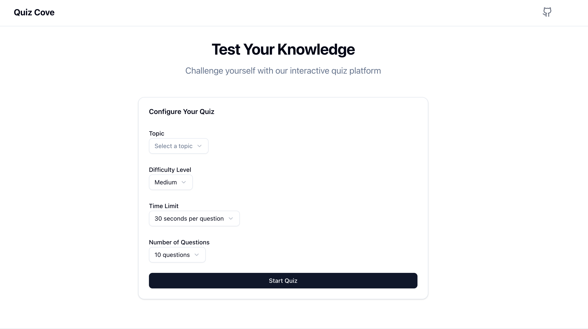

# QuizCove

A modern, interactive quiz application built with Next.js that allows users to test their knowledge on various topics with customizable settings and detailed analytics.


_Configure your quiz and start testing your knowledge!_

🚀 Features

- **Customizable Quiz Settings**

  - Choose from multiple topics
  - Select difficulty levels (Easy, Medium, Hard)
  - Set custom time limits
  - Configure number of questions
  - Multiple choice questions with single or multiple correct answers

- **Smart Quiz Management**

  - Auto-submission when time limit is reached
  - Auto-submission after answering all questions
  - Real-time progress tracking
  - Browser local storage for persistent data

- **Comprehensive Results**

  - Detailed score breakdown
  - Correct answers count
  - Total questions count
  - Total time taken to complete the quiz
  - Comparison of your answers vs correct answers
  - Explanations for correct answers

- **Performance Analytics (Coming Soon)**
  - Topic-wise performance tracking
  - Historical quiz results
  - Performance trends over time

## 🛠️ Tech Stack

- **Frontend Framework**: [Next.js](https://nextjs.org/) 15.3.2
- **Language**: [TypeScript](https://www.typescriptlang.org/)
- **Styling**: [Tailwind CSS](https://tailwindcss.com/)
- **UI Components**: [Shadcn UI](https://ui.shadcn.com/)
- **State Management**: [Zustand](https://github.com/pmndrs/zustand)
- **Data Storage**: Browser Local Storage
- **Questions Source**: JSON file-based API

## 📋 Prerequisites

Before you begin, ensure you have the following installed:

- Node.js (v18.0.0 or higher)
- npm (v9.0.0 or higher) or yarn (v1.22.0 or higher)
- Git

## 🚀 Getting Started

1. **Clone the repository**

   ```bash
   git clone https://github.com/yourusername/quizcove.git
   cd quizcove
   ```

2. **Install dependencies**

   ```bash
   npm install
   # or
   yarn install
   ```

3. **Run the development server**

   ```bash
   npm run dev
   # or
   yarn dev
   ```

4. **Open your browser**
   Visit [http://localhost:3000](http://localhost:3000) to see the application.

## 🏗️ Project Structure

```
quizcove/
├── app/              # Next.js app directory
├── components/       # Reusable UI components
├── data/            # Quiz questions and data
├── hooks/           # Custom React hooks
├── lib/             # Utility functions
├── store/           # State management
├── types/           # TypeScript type definitions
└── public/          # Static assets
```

## 📝 License

This project is licensed under the MIT License - see the [LICENSE](LICENSE) file for details.
